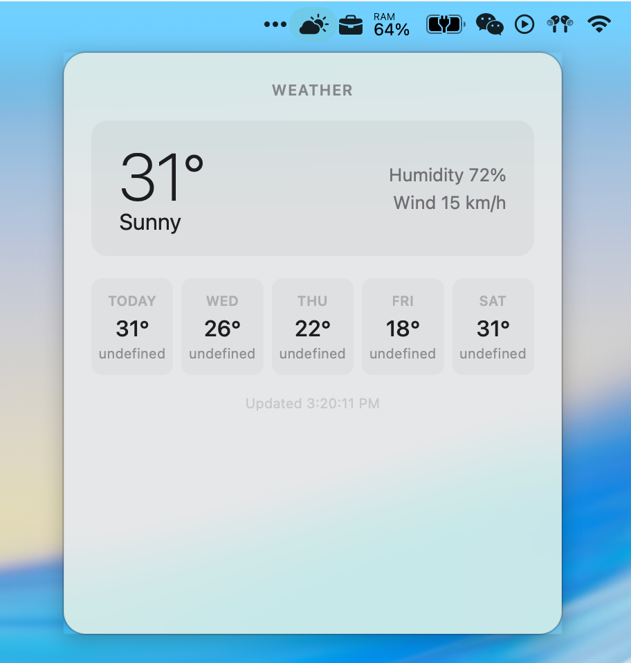
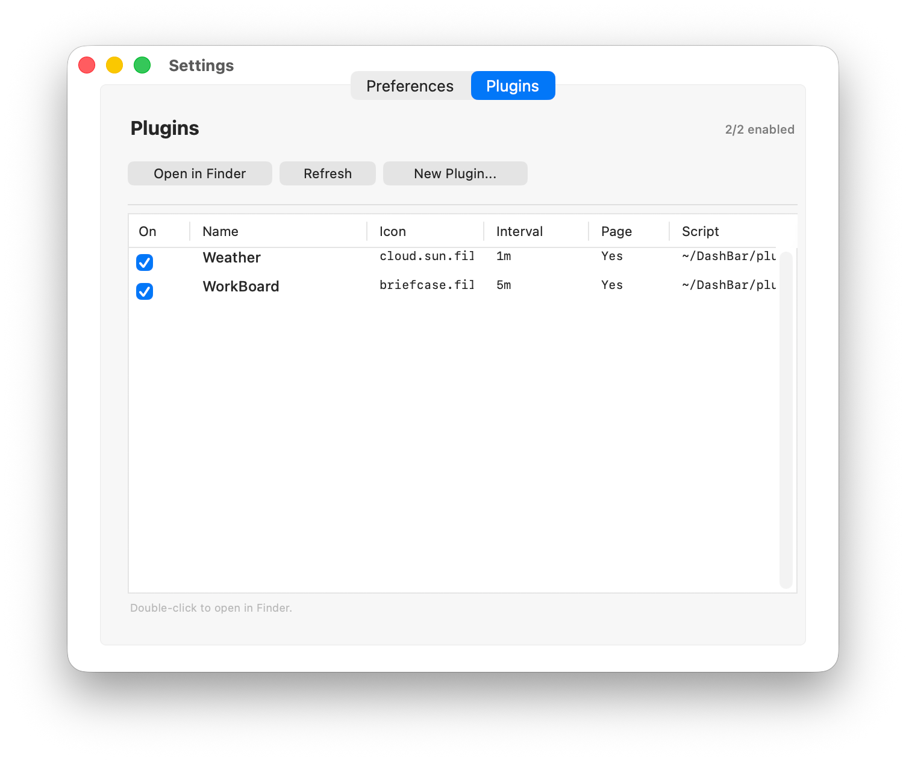

# DashBar

macOS menu bar plugin manager — turn your scripts into menu bar widgets.

Inspired by [SwiftBar](https://github.com/swiftbar/SwiftBar)'s plugin mechanism and [Stats](https://github.com/exelban/stats)'s popover panel style. Each plugin gets its own `NSStatusItem` and an HTML popover powered by `WKWebView`.

## Features

- **One plugin = one menu bar icon**: SF Symbols, custom PNG/PDF icons, or icon + text
- **HTML popover**: WKWebView rendering with JS↔Swift bridge, auto light/dark mode
- **Scheduled script execution**: `manifest.json` configuration with flexible intervals
- **Multi-language scripts**: auto-detect shebang, supports bash/python/ruby/node/swift
- **Settings window**: preferences + plugin management (enable/disable), English/Chinese
- **Launch at login**: via SMAppService

## Screenshots





## Plugin Format

### Folder plugin (recommended)

```
~/DashBar/plugins/my-plugin/
├── manifest.json    # name, interval, icon, HTML
├── run.sh           # any language (shebang auto-detected)
└── index.html       # popover content (optional)
```

**manifest.json:**
```json
{
  "name": "Weather",
  "interval": "1m",
  "script": "run.py",
  "html": "index.html",
  "popoverWidth": 380,
  "popoverHeight": 300,
  "popoverAutoHeight": false,
  "popoverMinHeight": 200,
  "popoverMaxHeight": 600,
  "sfSymbol": "cloud.sun.fill",
  "showText": false
}
```

| Field | Description |
|-------|-------------|
| `name` | Display name |
| `interval` | Refresh interval: `30s`, `10m`, `1h` |
| `script` | Script file name |
| `html` | Popover HTML (optional, plain text if omitted) |
| `popoverWidth/Height` | Popover dimensions |
| `popoverAutoHeight` | Enable auto-height (overrides `popoverHeight`) |
| `popoverMaxHeight` | Max height clamp when auto-height is on |
| `popoverMinHeight` | Min height clamp when auto-height is on |
| `sfSymbol` | SF Symbols icon name |
| `icon` | Custom icon file path |
| `showText` | Show script output text next to icon |

## HTML Popover Development

The plugin script outputs data via stdout. The popover HTML receives the output string through the `pushOutput(raw)` function.

### Link Behavior

WKWebView does not navigate to external pages inside the popover by default. Control `<a>` link behavior with the `data-open` attribute:

| `data-open` value | Behavior |
|---|---|
| `data-open="popover"` | Navigate inside the popover (with back/forward/home nav bar) |
| `data-open="browser"` | Open in external browser |
| No `data-open` (default) | Open in external browser, then close popover & reset to home |

```html
<!-- External browser: open DeepSeek top-up page -->
<a href="https://platform.deepseek.com/top_up" data-open="browser">Top Up</a>

<!-- In-popover navigation: open settings page -->
<a href="https://example.com/settings" data-open="popover">Settings</a>
```

When a link opens in the external browser, the popover automatically closes and resets to the home page. This behavior can be toggled in **Preferences → "Close popover after opening external link"**.

### JS↔Swift Bridge

```js
window.webkit.messageHandlers.bridge.postMessage({action: "refresh"})
```

### Light/Dark Mode

Use CSS `@media (prefers-color-scheme: light/dark)` or `color-scheme: light dark` with system color variables (`CanvasText`, etc.) for automatic adaptation.

### Single-file plugin (SwiftBar compatible)

```
~/DashBar/plugins/date.5s.sh    # runs every 5 seconds, plain text
~/DashBar/plugins/uptime.10s.sh # runs every 10 seconds
```

## Build

```bash
# Development run
swift run

# Package and install
./scripts/package.sh --install
```

## Tech Stack

- Swift 6 + AppKit
- WKWebView (HTML rendering + JS bridge)
- NSStatusItem (independent menu bar item per plugin)
- NSVisualEffectView (native frosted glass popover)
- SMAppService (login item management)

## License

MIT
